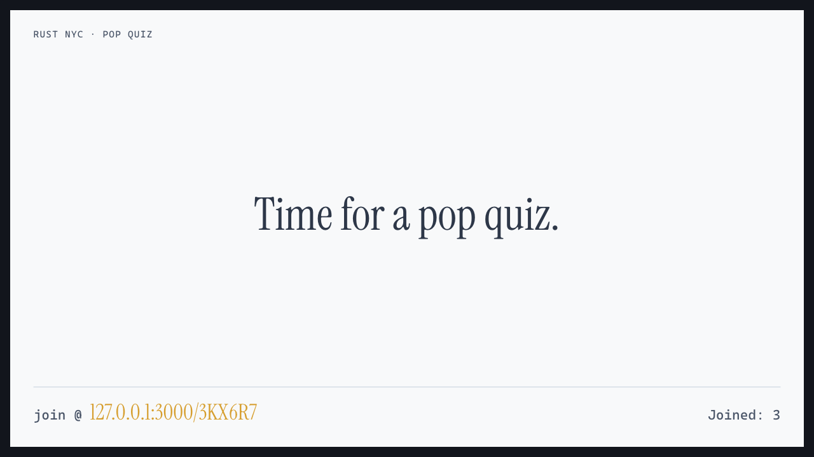
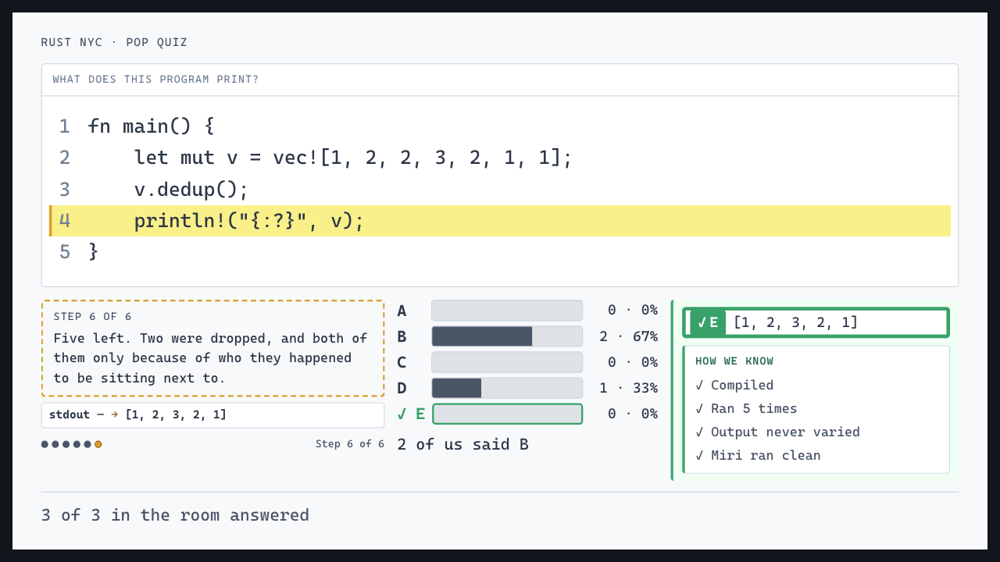
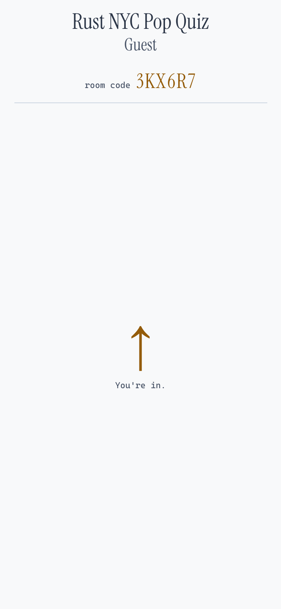
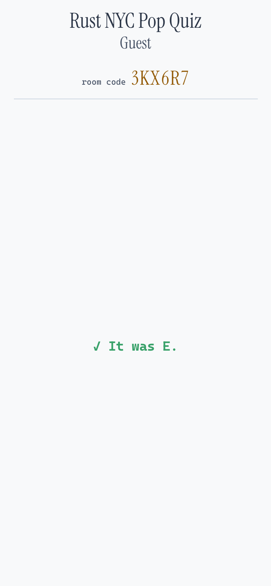
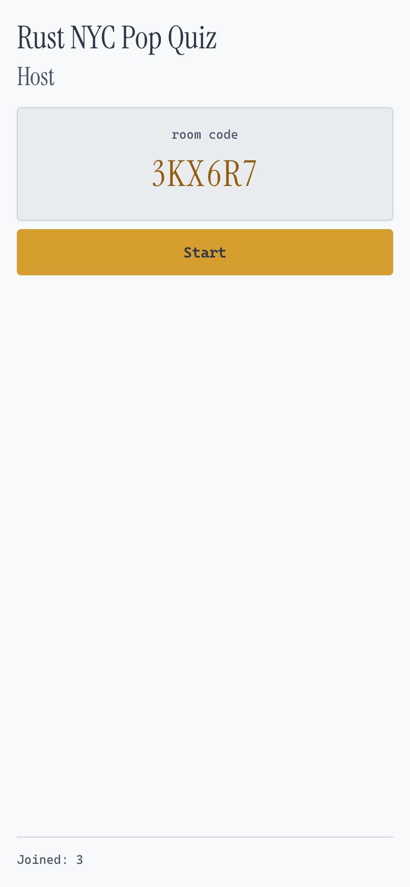
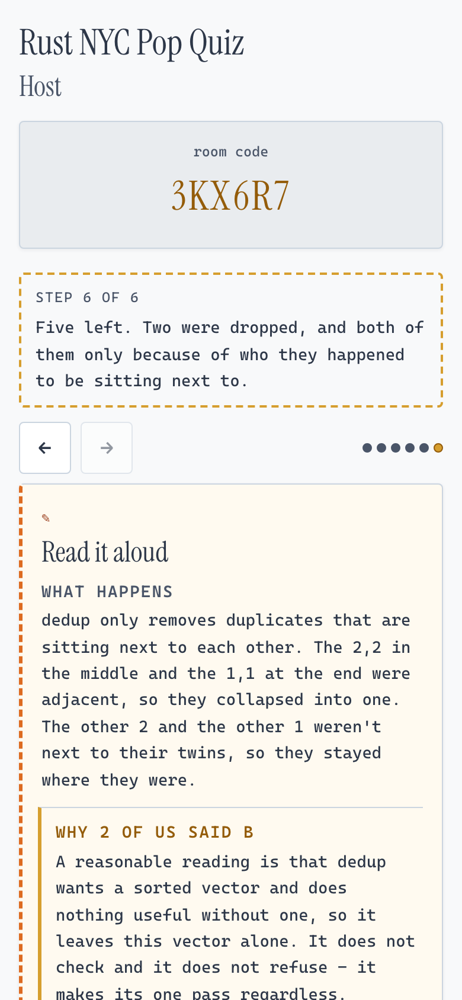

# Rust NYC Pop Quiz

I want fifty people at Rust NYC to look at nine lines of Rust, find out they
don't agree about what it prints, and work through it together until they do.
The quiz is the excuse. The understanding is the product.

One question, the last five minutes of the night. Nobody in the room has seen
it, and the answer comes from running the program, never from someone writing
it down.

## What the room sees

The live room is at https://rustnyc-popquiz.fly.dev. Three ways in:

- `/join` is the buzzer. Type the six-character room code.
- `/{code}` is the short link on the wall. It lands on `/join` with the code
  already filled in.
- `/wall/{room_id}` is the wall, for the projector. The room id comes from the
  host when the room is created.

A real local run from 2026-09-27: q3 on the wall, three phones in, idle and
then the reveal.

  

  

  
  
  
  

Try it:

1. The host creates a room on their phone and puts `/wall/{room_id}` on the projector.
2. Everyone else opens the short link on the wall, or `/join` and types the code.
3. The host presses Start. The program goes up on the wall and five letters show up on every phone.
4. Tap a letter. Change your mind as often as you like until the host closes answers.
5. The host shows the room its split, walks the trace, and reveals. Then everyone goes to the bar.

The live room already runs the copy in these screenshots. It changes when
`main` is next deployed ([Deploying](room/README.md#deploying-t-09)).

## Run it on your laptop

    just setup     # the one recipe that touches the network
    just test      # room, pipeline and web, in parallel, offline

You need `just`, `cargo`, `uv` and `node`. `uv` brings Python 3.12 with it.
`cargo` is whatever you already have. The pinned compiler that verifies
questions lives with the sandbox image, and building the server never needs it.

`EVALUATION.md` gives `just test` 60 seconds. It runs in about 12 here, warm. If
it ever stops feeling instant, something broke.

`just canary` is the secrecy suite. It drives a room through every phase with
planted secrets and fails if any of them reaches a phone or the wall before the
reveal.

A room you can drive at your desk:

    cd room && DISCORD_CLIENT_ID=… DISCORD_CLIENT_SECRET=… DISCORD_GUILD_ID=… DISCORD_ROLE_ID=… \
        POPQUIZ_PUBLIC_URL=http://localhost:3000 cargo run --bin room

Hosting is by Discord role, so the room needs the Discord application's four
values, from your shell and never from a file. The application must list
`http://localhost:3000/auth/discord/callback` as a redirect. Open
`http://localhost:3000/host?question=<id>`, sign in with Discord, create the
room, then open the wall and a couple of buzzer tabs and walk it through. The
rest is in [`room/README.md`](room/README.md#running-it).

A recipe whose suite isn't built yet fails and names the ticket that builds it.
`just burst` says T-21. Nothing looks green by not being there.

## How it works

Two halves, and they never talk during a meetup.

**The question pipeline** runs offline, with no deadline. Generate candidates,
run each one through a pinned `rustc` and Miri, drop duplicates, put the
survivors in front of an organizer, and keep a growing private bank. Freshness
is a supply problem, so it gets solved long before the night. Verify, dedupe and
the bank audit are built. Generate, review and schedule are still stubs.

**The live room** is Rust, `axum` and `tokio` on one small Fly.io machine. Seven
phases, `idle → live → closed → split → work → reveal → released`. The host
moves it one step at a time from their phone. There's no timer and nothing
advances on its own.

A few rules the code holds itself to:

- **The answer is sealed until the reveal.** It sits in a vault only the reveal
  phase can open, the compiler refuses code that tries to read it early, and
  `just canary` checks every payload at every phase.
- **Phones are anonymous.** A session is a token and an answer. No name, no
  account, no score.
- **Verification says exactly what ran.** "Miri ran clean" means no undefined
  behavior on the paths that executed, and nothing more.

Hosts sign in with Discord; the organizer role decides who can create a room.

## Where things live

| | |
|---|---|
| [`room/`](room/README.md) | The live room: phases, sessions, sockets, the pages, deploying |
| [`web/`](web/README.md) | The wall, the buzzer and the host phone. Plain HTML, CSS and JS, no build step |
| [`pipeline/`](pipeline/README.md) | Generate, verify, dedupe, review, the bank |
| [`bank/`](bank/README.md) | The question records |
| [`docs/RUNBOOK.md`](docs/RUNBOOK.md) | Running the Pop Quiz at a meetup: schedule, host, sync |
| [`mvp/`](mvp/README.md) | The hand-run projector deck. One HTML file, no server, already running real questions |
| [`PHILOSOPHY.md`](PHILOSOPHY.md) | The one thing, and the principles. Read it before changing anything people see |
| [`SPEC.md`](SPEC.md) | What to build, and the guardrails |
| [`DESIGN.md`](DESIGN.md) | The design the build reproduces one-to-one |
| [`EVALUATION.md`](EVALUATION.md) | How every criterion gets proven |
| [`BUILDPLAN.md`](BUILDPLAN.md) | The stack and the order of work |

[`PRD.md`](PRD.md) came first and is prior art now. Where it describes Val Town
and Modal, [`sequence/research/00-synthesis.md`](sequence/research/00-synthesis.md)
superseded it.

## Prior art

[`dtolnay/rust-quiz`](https://github.com/dtolnay/rust-quiz)
([play it](https://dtolnay.github.io/rust-quiz/)) is the original Rust quiz, and
this borrows its format: a short, legal Rust program, and the question is what
it prints. Its questions turn on the language's genuinely subtle corners: trait
resolution, `Drop` order, autoref, macro hygiene.

It's also why our last quiz died. Rust Quiz is a fixed, published set, and once
attendees had seen every question, the answer showed up before anyone had to
work for it. A remembered question gets no conversation at all. So every
question here is new, and a machine checks it before anyone sees it.
