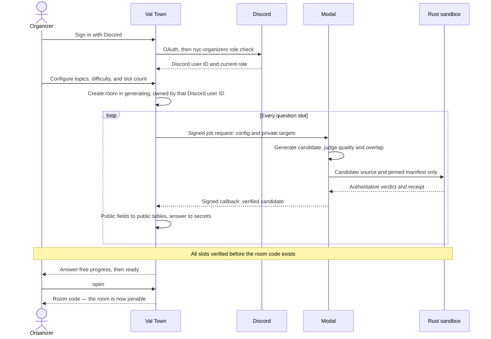
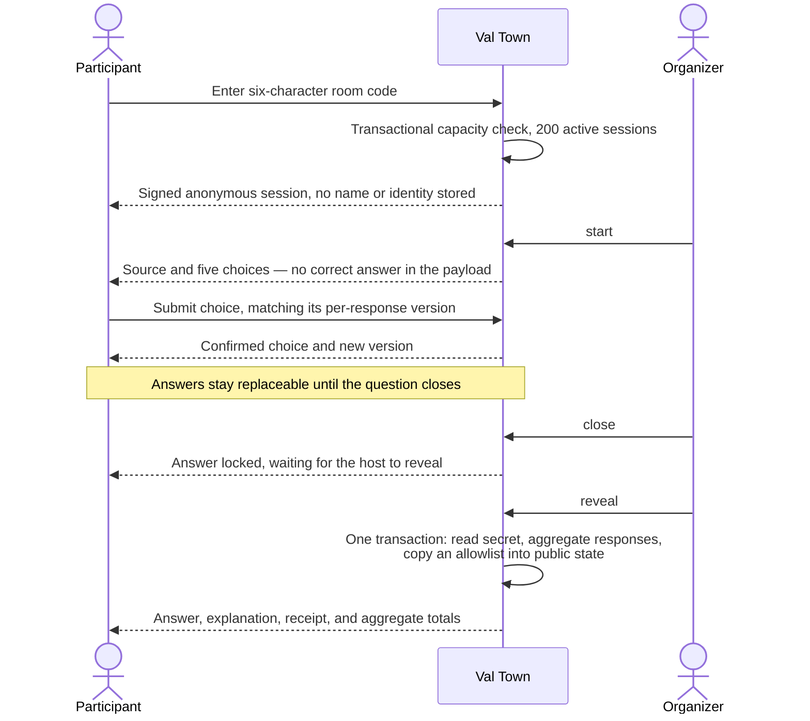

# Rust NYC Pop Quiz

Get your Rust friends together for a live pop quiz. You host, they play from
their phones, and every Rust program is generated fresh and compiler-verified.

## Status

Design phase. There is no implementation yet — no Rust, TypeScript, or Python
source, and no build or test tooling. This repository currently holds the
product requirements document and the configuration scaffolding that goes with
it.

## What's here

- **[`PRD.md`](PRD.md)** — the full design, and the place to start: product
  summary, Discord-based organizer authorization, the Val Town / Modal trust
  boundary, public interfaces, the brand and accessibility contract, acceptance
  tests, and delivery requirements.
- **[`.env.example`](.env.example)** — every environment variable the PRD
  requires, as names only. No value is ever assigned anywhere in this
  repository; Val Town and Modal each store secrets server-side and reference
  them by name.

## How it is meant to work

Rust NYC Pop Quiz is a host-led meetup quiz that generates original Rust
program-output questions for every session. Participants join anonymously from
their phones. Hosts sign in through Discord and must hold the `nyc-organizers`
role in the Rust East Coast server.

Every accepted question is checked by a pinned Rust compiler and Miri
configuration before the room opens, and the correct choice, explanation, and
verification outcome are withheld from every pre-reveal client payload.

A Val Town application is the participant-facing host and durable system of
record. A separate Modal application performs candidate generation and isolated
Rust verification.

## Data flow

### An organizer creates a room

Questions are generated and compiler-verified up front. A partially generated
room never opens, so the room code goes out only once every slot has passed
verification.

Modal holds no database, Discord, or session access — it receives a job and
returns a verified candidate, and the sandbox's verdict overrules whatever the
model claimed the program prints.

### A participant joins and answers

No browser has an edge to the secret store. The correct choice, explanation, and
verification evidence reach a client only after the reveal transaction copies an
explicit allowlist of fields into public state — the deadline is
server-authoritative, so closing is not something a client can talk its way out
of.

[`PRD.md`](PRD.md#data-flow-and-trust-boundaries) carries the normative version
of this diagram, with the telemetry and uniqueness-query edges this one omits.

## Prior art

[`dtolnay/rust-quiz`](https://github.com/dtolnay/rust-quiz)
([play it](https://dtolnay.github.io/rust-quiz/)) is the original Rust quiz and
the format this project borrows: a short, legal Rust program, and the question
is what it prints. Its questions turn on the language's genuinely subtle
corners — trait resolution, `Drop` order, autoref, macro hygiene.

The difference is the question bank. Rust Quiz is a fixed, published set, so a
repeat attendee can recognize a question they have already seen. This project
generates every question fresh per session and verifies the expected output
with a pinned toolchain instead of curating answers by hand.

## Reference implementation

[`colelawrence/rust-nyc-talk-submissions`](https://github.com/colelawrence/rust-nyc-talk-submissions)
is a deployed Val Town application on the same stack — React plus Hono,
val-scoped SQLite, git-synced to GitHub through an Actions workflow — wearing
the Rust NYC brand. It is the layout and tooling model to follow when code lands
here.

Its `BRAND_STYLE_GUIDE.md` is the source of the PRD's brand section, with two
deliberate overrides where the PRD corrects AA contrast failures. Where the two
disagree, the PRD is normative.
