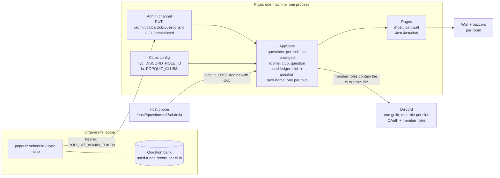
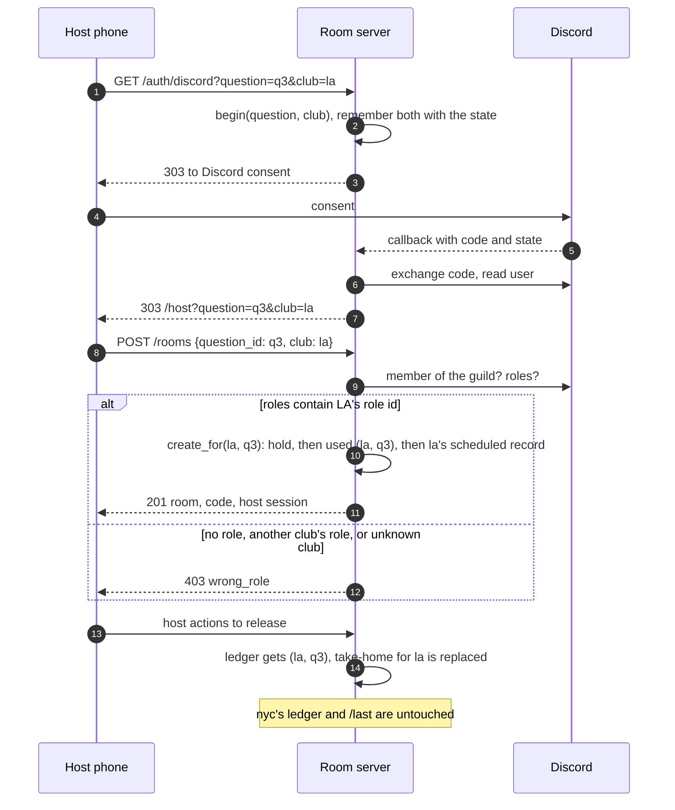

# ADR-0001: Several clubs share one room server

**Status:** Accepted
**Date:** 2026-10-09
**Deciders:** the client (call recorded as D-26 in `sequence/run-state.md`); built in PR #52
**Contract:** D-26, AC-103, AC-104, AC-105; amends G-9, G-10 (`SPEC.md`)

## Context

The room server was built for one club. It had one Discord role that may host
(`DISCORD_ROLE_ID`), a used-question ledger keyed by question id alone, a rule of
one live room per question, and one global `/last` page.

Other clubs want to use the pop quiz. LA Rust wants to run the same question as
Rust NYC, on its own night, with its own organizers. The client chose to keep
**one Discord server** and give **each club its own host role**.

What stood in the way:

| Blocker | Where | Effect |
|---|---|---|
| One room per question | `Room::holds` / `create_for` | NYC and LA could not both hold `q3` |
| Never twice, by question id | `UsedLedger::contains` | Once NYC released `q3`, LA was refused it |
| One host role | `discord.rs` role check | An LA organizer got `wrong_role` |
| One take-it-home snapshot | `AppState::take_home` | One club's release replaced the other's page |

## Decision

A **club** is `{slug, role id, zone}`. One server, one guild, one question bank.

- **Roles.** `DISCORD_ROLE_ID` is the default club, `nyc`. `POPQUIZ_CLUBS`
  (`la=<role id>:America/Los_Angeles`, comma-separated) adds the rest. Hosting
  needs the role ID of the club the organizer names, compared by ID in `roles`
  (AC-65 stands). A role from another club, an unknown club and a malformed club
  are all `403 wrong_role`, so the answer does not say which clubs exist.
- **Never twice is per club.** The used ledger is keyed `(club, question)`.
  The live-room hold is per `(club, question)` too, so two clubs can run one
  question at the same time.
- **The host names the club in the URL:** `/host?question=q3&club=la`. The
  sign-in carries it to Discord and back. No club means `nyc`, so old links work.
- **Take it home is per club:** `/last/{club}`; `/last` is `nyc`'s. A released
  wall links to its own club's page.
- **The bank is shared; a scheduled record is not.** What `popquiz schedule`
  pushes is the question *arranged for one meetup date* (the answer slot and the
  other options move with the date), so the room keeps it per club:
  `PUT /admin/clubs/{club}/questions/{id}`, with the old `PUT
  /admin/questions/{id}` as the `nyc` spelling. A club's room is built from that
  club's record only. "Already run" is checked when a room is made, where the
  club is known. *Run it again* stays in the old room's club. (First draft kept
  the PUT club-less; review found NYC's room would get LA's option order, AC-23.)
- **The fallback links to the club's own page:** `/last` for `nyc`, `/last/{club}`
  otherwise, unless `--home-link` says otherwise.
- **Meetup date** is read in the club's zone (four US zones, one daylight rule).
- **Pipeline:** `Question.used` is one record per club. `schedule`, `sync` and
  `reserve` take `--club`.

### Components

### Creating and releasing a room for LA

## Options Considered

### Option A: Club per request, shared server and bank (chosen)

| Dimension | Assessment |
|---|---|
| Complexity | Medium: one new type, a key change in five places |
| Cost | One Fly machine, as now |
| Scalability | Fine for a few clubs; state is still in memory |
| Team familiarity | High: same code paths, same Discord check |

**Pros:** one deploy and one bank; the Discord check stays a role-ID test;
existing links and the NYC flow are unchanged.
**Cons:** a club is config, not data; the ledger is still lost on restart.

### Option B: A Discord server per club

| Dimension | Assessment |
|---|---|
| Complexity | Higher: a guild id per club in the sign-in and the member lookup |
| Cost | Each club needs its own Discord application settings |
| Team familiarity | Medium |

**Pros:** clean separation of organizers.
**Cons:** the client chose one server; more secrets and more setup per club.

### Option C: A global used ledger (keep "never twice" across clubs)

**Pros:** no key change.
**Cons:** LA could never run a question NYC had run, which defeats the point of
sharing the bank. Rejected.

### Option D: A deployment per club

**Pros:** no code change.
**Cons:** a second Fly app, a second bank sync, a second token, and the same
question could not be shared in one ledger. The room's state is one machine's
memory, so this is the same cost per club forever. Rejected.

### Option E: Infer the club from the member's roles

**Pros:** no `club` in the URL.
**Cons:** a person holding two clubs' roles needs a picker, and the link would
no longer say which room it makes. Rejected in favour of naming the club.

## Trade-off Analysis

The hard question was what "never run twice" protects. It protects a crowd from
seeing the same question twice, so its natural unit is a club (a crowd), not the
bank. Keying by club keeps the rule and lets the bank be shared. The price is a
wider key in the ledger, the hold check, the take-home snapshot and the bank's
`used` field.

## Consequences

**Easier:** adding a club is one config line and one Discord role. The bank,
the deploy and the admin token are shared.

**Harder / accepted:**
- A restart still empties the question store **and** the ledger for every club.
  Push the question again before creating a room (`room/README.md`, *Deploying*).
- The wrong-server message still says "Rust NYC server": the shared server is
  that guild.
- The wall's branding is still Rust NYC's; the wordmark is pinned by the copy
  freeze tests.
- Zones are limited to four US zones: there is no date crate, so a zone is its
  standard offset plus the US daylight rule.
- `Question.used` changed from an object to a list. A bare object reads as the
  `nyc` record, so existing bank files still load.

**To revisit:** per-club wall branding and copy; a durable ledger so a restart
does not forget what a club has run; an admin token per club if clubs stop
trusting one organizer.

## Action Items

1. [x] Contract: D-26, AC-103…105, `SPEC.md` G-9 / G-10 / §3.1 (PR #52)
2. [x] Room: `club.rs`, Discord check, rooms, ledger, `/last/{club}` (PR #52)
3. [x] Host page and pipeline: `club` in the URL, `--club` (PR #52)
4. [ ] Create the LA host role in the Discord server; set `POPQUIZ_CLUBS` in `fly.toml`
5. [ ] Deploy (`fly deploy --ha=false`), push the question, sign in as an LA host
6. [ ] Decide on per-club wall branding and a durable ledger

## Where it lives

`room/src/club.rs` · `room/src/discord.rs` · `room/src/rooms.rs` ·
`room/src/used.rs` · `room/src/routes.rs` · `room/src/view.rs` ·
`web/host/host.js` · `pipeline/src/popquiz/bank.py` ·
`pipeline/src/popquiz/schedule.py` · tests: `room/tests/clubs.rs`
