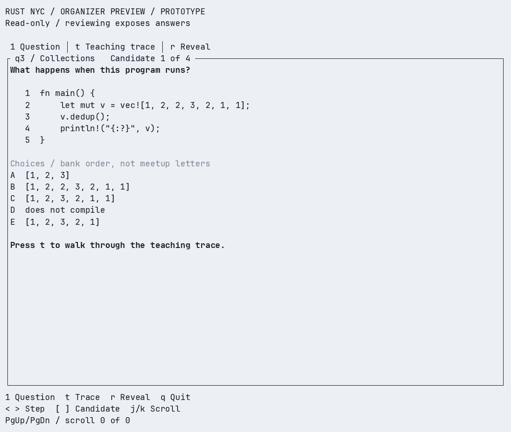

# Organizer preview

Preview a Rust quiz question and rehearse its teaching trace in the terminal.
Read the code and choices, step through the explanation, then reveal the answer.

The preview reads questions from the bank without changing them.



The recording selects and opens a teaching step, moves keyboard focus between
panes, reveals the answer, and opens help. [Download the terminal recording](recordings/organizer-preview.cast)
to replay it with `asciinema play recordings/organizer-preview.cast`.

## Run

From the repository root:

```sh
cd prototypes/organizer-tui
cargo run --locked -- --question q3
```

The first build downloads dependencies. Use a terminal at least 40 columns wide
and 14 rows tall; 136 × 41 gives the code and narration more room. Below 80
columns, the focused pane fills the view. Tab switches panes.

To load another bank, add `--bank /path/to/bank`. That directory must contain a
`questions/` subdirectory with the question JSON files.

## Controls

| Key | Action |
| --- | --- |
| `1` | Show the question and five choices |
| `t` | Switch between the question and teaching trace |
| Tab | Move focus between steps, source, and narration |
| Enter | Open the selected teaching step |
| Left / Right or `<` / `>` | Step backward or forward |
| `r` | Reveal the answer and final trace step |
| `[` / `]` | Open the previous or next question |
| Up / Down or `k` / `j` | Select a step, or scroll the focused pane |
| Page Up / Page Down | Move ten steps or scroll ten rows |
| Escape | Close help, return focus to steps, or go back to the question |
| `?` | Open or close keyboard help |
| `q` or Ctrl-C | Exit and restore the terminal |

Each trace step highlights the relevant code and shows the host's narration and
value changes. These steps are written as a teaching aid; the values are not
captured from a debugger.

The left list selects a step without changing the source or narration. Enter
opens that step. Left and Right step through the walkthrough immediately.
The focused pane has an amber border and a `FOCUS` label.

In the teaching trace, navigation stops before the final step. Press `r` to see that step, the answer,
the explanation, why the other choices are tempting, and the verification receipt.
Switching questions returns to the question view.

## Print a preview

Use `--snapshot` to print a screen without starting the interactive interface:

```sh
cargo run --locked -- --question q3 --snapshot question
cargo run --locked -- --question q3 --snapshot trace
cargo run --locked -- --question q3 --snapshot reveal
```

## Current limits

This prototype previews existing questions. Generation, editing, review decisions,
explanation approval, scheduling, and projector preview are not implemented.

Choices appear in bank order. Their letters can differ from the meetup's
date-based order. The preview does not check whether a question has already been
used; `q3` is included here as a demo.

Answers and receipts come from the saved verification records. Opening a question
does not run rustc or Miri. Older records identify Miri checks run outside the
verifier.

Long source lines wrap, and syntax highlighting is not implemented. Check
legibility in the actual projector view before using a question at a meetup.

## Development

The preview uses Ratatui 0.30.2 and Crossterm. It shares answer derivation and
receipt rendering with the `room` crate. Snapshots and rendering tests use
Ratatui's `TestBackend`.

```sh
cargo test --locked
cargo clippy --locked --all-targets -- -D warnings
cargo fmt --check
```

See [VALIDATION.md](VALIDATION.md) for test results. This Cargo package is built
separately from the live room and is not included in its deployment.
